# Airway Bulk RNA-seq Walkthrough

**Looking for the full reading-first guide?**\
The full bulk RNA-seq guide lives on the website here:
<https://trhova.github.io/guides/bulk-rna-seq/>

This GitHub repository is the runnable companion walkthrough in R. Use
the website guide for the broader conceptual overview, and use this repo
when you want a minimal reproducible example with scripts, figures, and
tables.

## 1. Project overview

This repository is a small, end-to-end transcriptomics teaching case
study built around the Bioconductor **airway** dataset. The goal is to
show a coherent progression from raw count data to biological
interpretation using one clean, reproducible dataset rather than many
disconnected examples.

The `airway` dataset was chosen because it is:

- small enough to run locally
- biologically interpretable
- already packaged in Bioconductor
- widely used in teaching DESeq2 and related workflows

This walkthrough covers:

- gene-level differential expression
- gene set–level interpretation with ORA and GSEA
- sample-level pathway/state activity with ssGSEA
- regulatory/signaling inference with PROGENy and DoRothEA + VIPER
- a brief note on transcript/genome-aware follow-up as an advanced
  extension

To reproduce the tutorial:

1.  `Rscript scripts/00_setup.R`
2.  `Rscript scripts/01_load_and_qc.R`
3.  `Rscript scripts/02_deseq2.R`
4.  `Rscript scripts/03_ora_gsea.R`
5.  `Rscript scripts/04_gsva_ssgsea.R`
6.  `Rscript scripts/05_progeny_viper.R`
7.  `Rscript scripts/99_render_readme.R`

## 2. Data and experimental design

**Biological question**\
How does dexamethasone treatment change the transcriptome of human
primary airway smooth muscle cells when donor identity is taken into
account?

**Input**\
The Bioconductor `airway` dataset: 8 samples from 4 donor-matched
treated/untreated pairs.

**Core method**\
Represent the experiment as a paired bulk RNA-seq design with the
formula `~ cell + dex`, where `cell` captures donor identity and `dex`
captures treatment.

**Main outputs**\
Clean sample metadata plus a visual summary of the paired design.

**Interpretation**\
This is a simple but important design: each donor contributes both an
untreated and a treated sample, so treatment is estimated within donor
rather than across unmatched samples.

**Script**\
[scripts/01_load_and_qc.R](scripts/01_load_and_qc.R)

### Sample metadata

| sample_id  | cell    | dex   | albut | run        |
|:-----------|:--------|:------|:------|:-----------|
| SRR1039508 | N61311  | untrt | untrt | SRR1039508 |
| SRR1039509 | N61311  | trt   | untrt | SRR1039509 |
| SRR1039512 | N052611 | untrt | untrt | SRR1039512 |
| SRR1039513 | N052611 | trt   | untrt | SRR1039513 |
| SRR1039516 | N080611 | untrt | untrt | SRR1039516 |
| SRR1039517 | N080611 | trt   | untrt | SRR1039517 |
| SRR1039520 | N061011 | untrt | untrt | SRR1039520 |
| SRR1039521 | N061011 | trt   | untrt | SRR1039521 |

<figure>
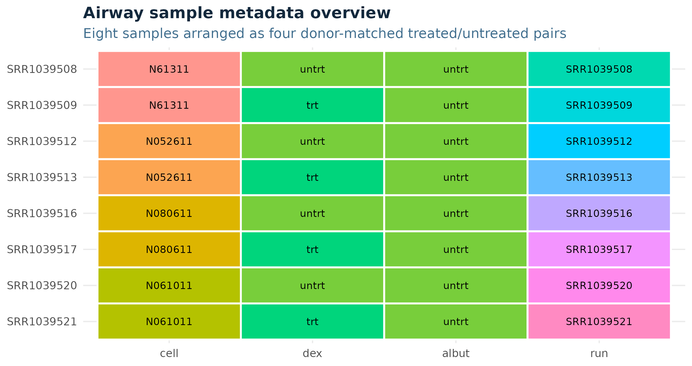
<figcaption aria-hidden="true">Sample metadata overview</figcaption>
</figure>

## 3. Exploratory analysis and QC

**Biological question**\
Do the samples look broadly well-behaved before we start making
biological claims?

**Input**\
The airway count matrix and the paired sample metadata.

**Core method**\
Inspect library sizes, transform counts with VST for visualization, and
examine PCA plus sample-to-sample distances.

**Main outputs**\
Library size plot, PCA plot, and sample distance heatmap.

**Interpretation**\
These plots answer whether the data are technically usable and whether
donor structure and treatment structure are visible in the transformed
expression space.

**Script**\
[scripts/01_load_and_qc.R](scripts/01_load_and_qc.R)

### Library sizes

<figure>
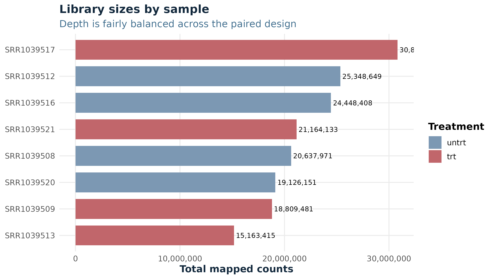
<figcaption aria-hidden="true">Library sizes</figcaption>
</figure>

The library sizes are reasonably balanced for a small teaching dataset.
Nothing here suggests a catastrophic sequencing-depth imbalance that
would dominate the analysis.

### PCA on VST data

<figure>
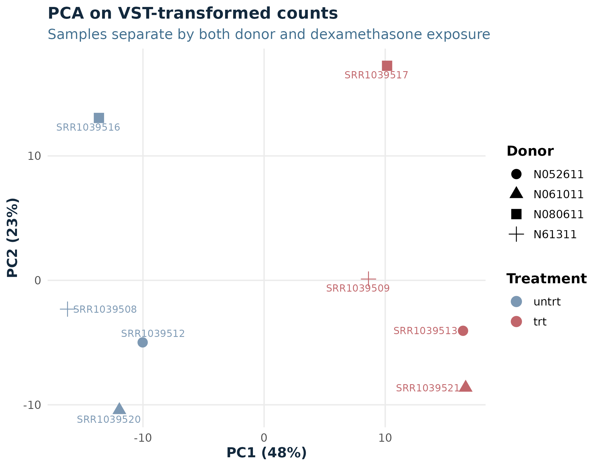
<figcaption aria-hidden="true">PCA plot</figcaption>
</figure>

The PCA is a quick check of sample structure. In this dataset, donor
identity is still a major source of variation, but dexamethasone
treatment also contributes visible separation. That is exactly why the
paired design matters.

### Sample distance heatmap

<figure>
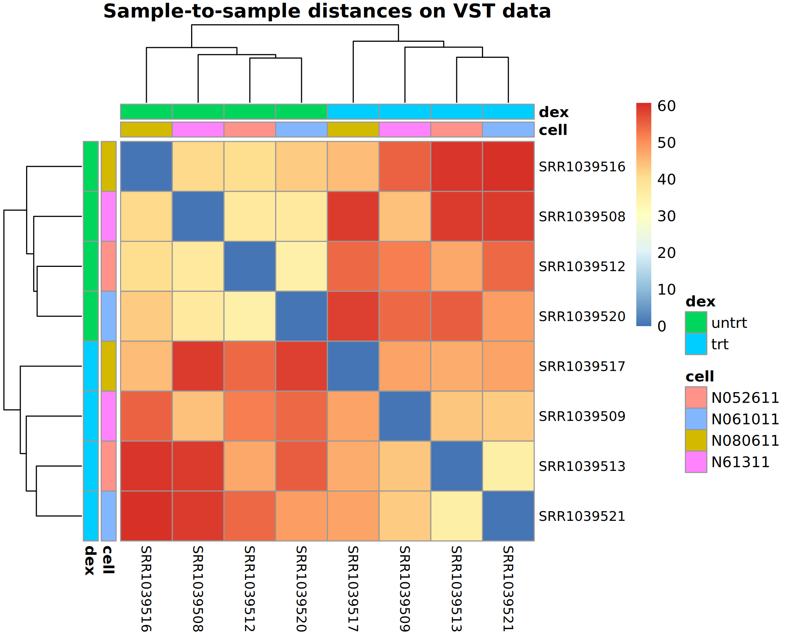
<figcaption aria-hidden="true">Sample distance heatmap</figcaption>
</figure>

The distance heatmap gives the same idea in matrix form: samples from
the same donor remain similar, while treatment introduces a systematic
shift on top of that donor structure.

## 4. Differential expression with DESeq2

**Biological question**\
Which genes change with dexamethasone treatment after accounting for
donor-to-donor differences?

**Input**\
Raw gene-level counts and the paired design matrix `~ cell + dex`.

**Core method**\
Fit a DESeq2 negative-binomial model, test the dex effect, and stabilize
effect sizes with `lfcShrink`.

**Main outputs**\
DESeq2 summary table, MA plot, volcano plot, and a compact table of top
differential-expression hits.

**Interpretation**\
This is the gene-level layer of the story. It tells us which genes move,
in which direction, and with what statistical support.

**Script**\
[scripts/02_deseq2.R](scripts/02_deseq2.R)

### What DESeq2 is doing

DESeq2 models the **raw counts** directly using a negative-binomial
framework. It handles normalization internally, estimates dispersion,
and then tests whether the treatment coefficient is different from zero
after accounting for donor identity.

This distinction matters:

- **`padj`** is the main inference output. It tells you whether the
  gene-level change is statistically convincing after multiple-testing
  correction.
- **`log2FoldChange`** is the estimated effect size. It tells you how
  large the change is and in which direction.
- **`lfcShrink`** pulls noisy fold changes toward more stable values,
  which makes gene ranking and interpretation more trustworthy.
- **`VST`** is for visualization, clustering, and distance-based
  exploration. It is **not** the data that DESeq2 uses for the
  hypothesis test.

### DESeq2 summary

| metric                                  | value |
|:----------------------------------------|------:|
| Genes tested                            | 16782 |
| Significant genes (padj \< 0.05)        |  4028 |
| Significant genes with \|log2FC\| \>= 1 |   816 |
| Up-regulated genes                      |   450 |
| Down-regulated genes                    |   366 |

### MA plot

<figure>
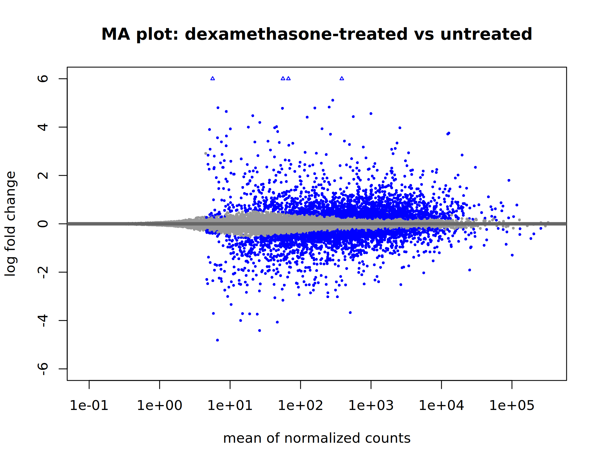
<figcaption aria-hidden="true">MA plot</figcaption>
</figure>

The MA plot shows that dexamethasone changes expression for a
non-trivial subset of genes, while most genes remain near zero effect.
That is the pattern expected from a targeted treatment response rather
than a global transcriptome collapse.

### Volcano plot

<figure>
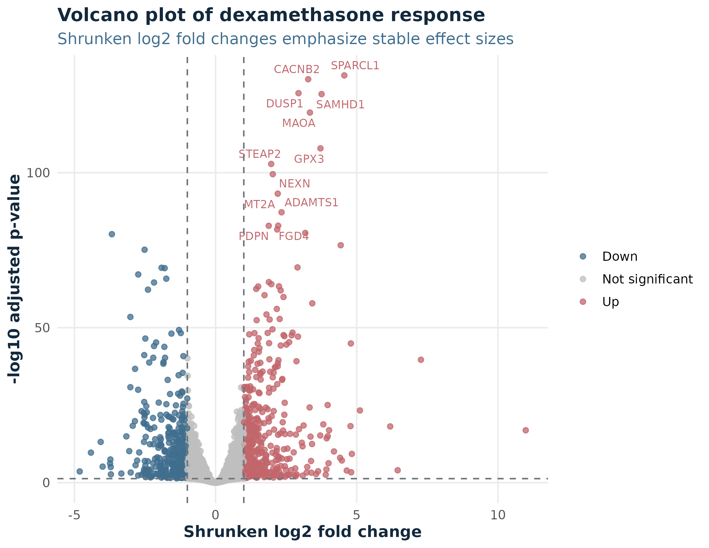
<figcaption aria-hidden="true">Volcano plot</figcaption>
</figure>

The volcano plot combines significance and effect size. It is useful as
a visual ranking aid, but the actual interpretation should still come
from the results table plus the biological context.

### Top DE genes

| gene_id         | gene_symbol | baseMean | log2FoldChange |  lfcSE | pvalue | padj |
|:----------------|:------------|---------:|---------------:|-------:|-------:|-----:|
| ENSG00000152583 | SPARCL1     |      997 |           4.56 | 0.1860 |      0 |    0 |
| ENSG00000165995 | CACNB2      |      495 |           3.28 | 0.1330 |      0 |    0 |
| ENSG00000120129 | DUSP1       |     3410 |           2.94 | 0.1220 |      0 |    0 |
| ENSG00000101347 | SAMHD1      |    12700 |           3.75 | 0.1570 |      0 |    0 |
| ENSG00000189221 | MAOA        |     2340 |           3.34 | 0.1430 |      0 |    0 |
| ENSG00000211445 | GPX3        |    12300 |           3.72 | 0.1680 |      0 |    0 |
| ENSG00000157214 | STEAP2      |     3010 |           1.97 | 0.0902 |      0 |    0 |
| ENSG00000162614 | NEXN        |     5390 |           2.03 | 0.0945 |      0 |    0 |
| ENSG00000125148 | MT2A        |     3660 |           2.20 | 0.1060 |      0 |    0 |
| ENSG00000154734 | ADAMTS1     |    30300 |           2.34 | 0.1160 |      0 |    0 |
| ENSG00000139132 | FGD4        |     1220 |           2.22 | 0.1130 |      0 |    0 |
| ENSG00000162493 | PDPN        |     1100 |           1.88 | 0.0960 |      0 |    0 |
| ENSG00000134243 | SORT1       |     5510 |           2.18 | 0.1130 |      0 |    0 |
| ENSG00000179094 | PER1        |      777 |           3.18 | 0.1650 |      0 |    0 |
| ENSG00000162692 | VCAM1       |      508 |          -3.67 | 0.1920 |      0 |    0 |

At this point we have a credible gene-level result, but DE alone is not
the full biological interpretation. The next question is what these
genes are doing together.

## 5. Functional interpretation

### 5a. ORA

**Biological question**\
What biological themes are over-represented among the genes that clearly
change with treatment?

**Input**\
A thresholded DEG list using `padj < 0.05` and `|log2FoldChange| >= 1`.

**Core method**\
Over-representation analysis (ORA) on up- and down-regulated genes
separately using the curated Hallmark gene-set collection.

**Main outputs**\
ORA summary plot and tables of top enriched biological themes.

**Interpretation**\
ORA gives a first-pass biological summary, but it depends on the
threshold used to define DE genes.

**Script**\
[scripts/03_ora_gsea.R](scripts/03_ora_gsea.R)

<figure>
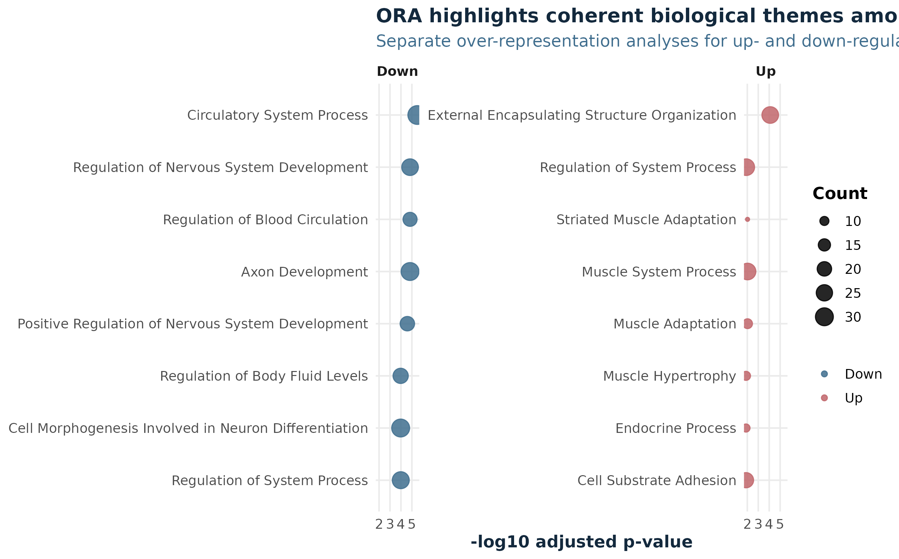
<figcaption aria-hidden="true">ORA summary</figcaption>
</figure>

#### Top up-regulated themes

| Term                              | GeneRatio | Count | p.adjust |
|:----------------------------------|:----------|------:|---------:|
| TNFA Signaling via NFkB           | 26/415    |    26 | 0.00e+00 |
| Epithelial Mesenchymal Transition | 20/415    |    20 | 1.31e-05 |
| Hypoxia                           | 15/415    |    15 | 1.64e-03 |
| Xenobiotic Metabolism             | 12/415    |    12 | 1.94e-02 |
| UV Response Down                  | 11/415    |    11 | 1.94e-02 |
| Adipogenesis                      | 13/415    |    13 | 1.99e-02 |

#### Top down-regulated themes

| Term                              | GeneRatio | Count | p.adjust |
|:----------------------------------|:----------|------:|---------:|
| Epithelial Mesenchymal Transition | 16/345    |    16 | 0.000566 |
| P53 Pathway                       | 14/345    |    14 | 0.002000 |
| KRAS Signaling Up                 | 12/345    |    12 | 0.002320 |
| TNFA Signaling via NFkB           | 12/345    |    12 | 0.008040 |
| Inflammatory Response             | 10/345    |    10 | 0.011600 |
| Interferon Gamma Response         | 10/345    |    10 | 0.036800 |

In this dataset, ORA highlights the clearest treatment-associated
programs once we draw a hard line around the DE genes. That is useful,
but it still throws away the graded information in the full ranked
result.

### 5b. GSEA

**Biological question**\
Do coherent pathways shift across the full ranked gene list, even if
some of their member genes do not cross a hard DEG cutoff?

**Input**\
A ranked gene list derived from the DE result, using shrunken log2 fold
changes.

**Core method**\
Gene set enrichment analysis (GSEA) with Hallmark pathways from
`msigdbr`.

**Main outputs**\
GSEA summary plot, top term table, and one positive plus one negative
enrichment plot.

**Interpretation**\
GSEA complements ORA by using the whole ranked result. It is often more
sensitive to coordinated but moderate shifts.

**Script**\
[scripts/03_ora_gsea.R](scripts/03_ora_gsea.R)

<figure>
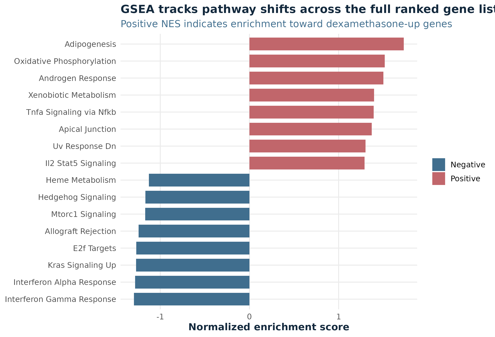
<figcaption aria-hidden="true">GSEA summary</figcaption>
</figure>

| Pathway                   |   NES |    padj | size | direction |
|:--------------------------|------:|--------:|-----:|:----------|
| Adipogenesis              |  1.76 | 0.00072 |  196 | Positive  |
| Oxidative Phosphorylation |  1.54 | 0.03620 |  199 | Positive  |
| Androgen Response         |  1.52 | 0.12900 |   97 | Positive  |
| Xenobiotic Metabolism     |  1.42 | 0.12900 |  192 | Positive  |
| Interferon Gamma Response | -1.28 | 0.18500 |  189 | Negative  |
| E2F Targets               | -1.27 | 0.18500 |  200 | Negative  |
| KRAS Signaling Up         | -1.26 | 0.18500 |  182 | Negative  |
| Allograft Rejection       | -1.23 | 0.20800 |  174 | Negative  |

<figure>
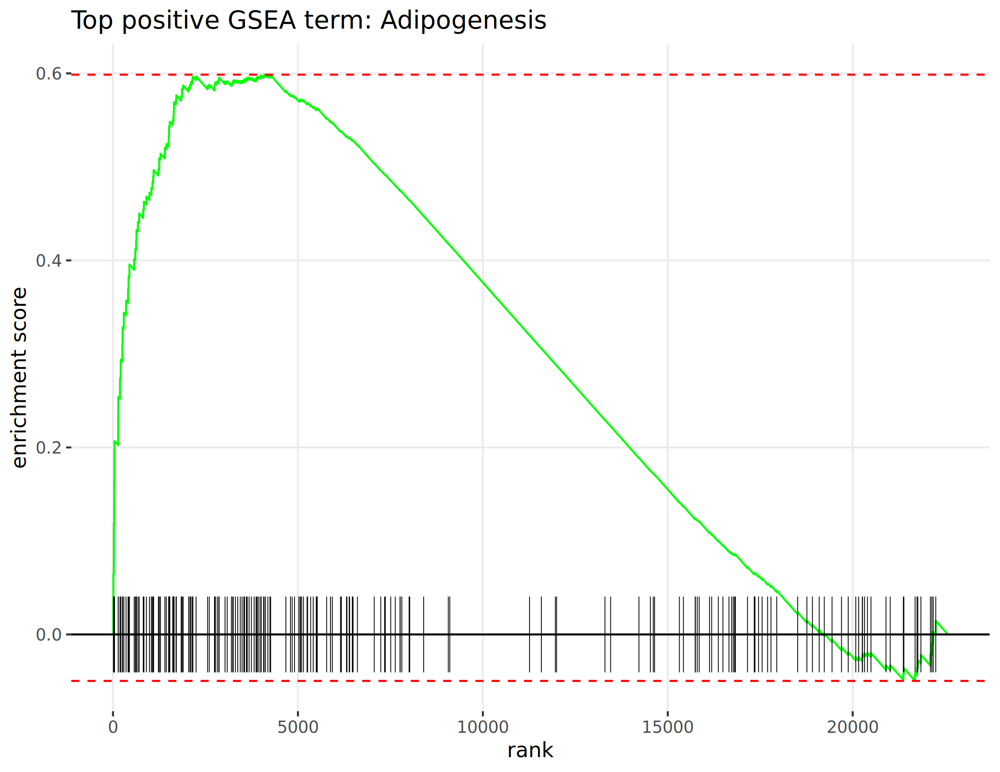
<figcaption aria-hidden="true">Top positive GSEA term</figcaption>
</figure>

<figure>
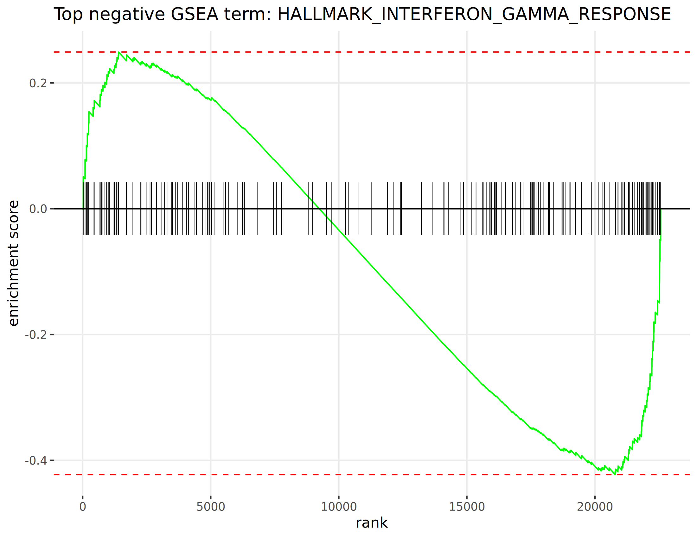
<figcaption aria-hidden="true">Top negative GSEA term</figcaption>
</figure>

This layer shifts the interpretation from “which genes changed?” to
“which programs moved coherently with treatment?” That usually gives a
more stable biological story than reading the DEG table gene by gene.

## 6. Sample-level pathway/state activity

**Biological question**\
How do pathway or cell-state programs vary across individual samples,
not just between the two group means?

**Input**\
VST-transformed expression values plus a small local signature panel.

**Core method**\
Single-sample GSEA (`ssGSEA`) using curated pathway/state signatures
relevant to inflammation, signaling, proliferation, and stress.

**Main outputs**\
Per-sample score table and a heatmap of pathway/state activity.

**Interpretation**\
These are sample-level program scores. They summarize coordinated
expression behavior in each sample; they are not another DE test.

**Script**\
[scripts/04_gsva_ssgsea.R](scripts/04_gsva_ssgsea.R)

<figure>
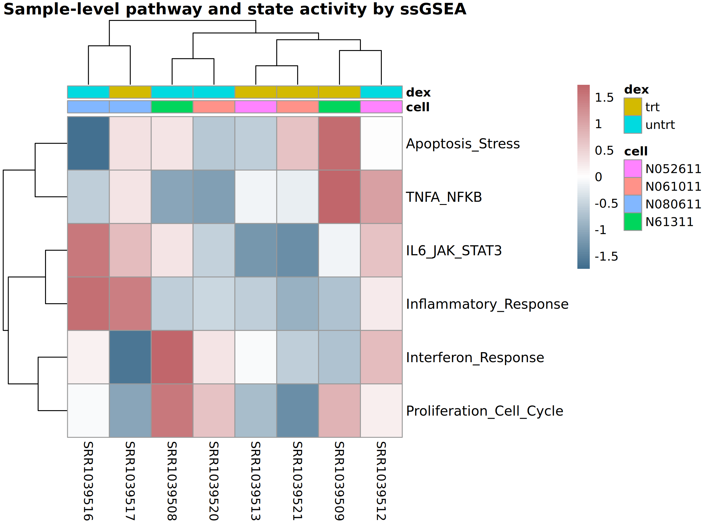
<figcaption aria-hidden="true">ssGSEA heatmap</figcaption>
</figure>

The heatmap asks a different question from DESeq2. Instead of testing
each gene one by one, it asks whether each sample looks more
inflammatory, more stress-like, or more proliferative according to a
signature. That makes it easier to see whether treatment produces a
consistent program-level shift across donors.

## 7. Regulatory/signaling inference

**Biological question**\
What upstream signaling pathways or transcription factors might be
driving the observed gene-expression changes?

**Input**\
The same VST-transformed expression matrix used for sample-level
scoring.

**Core method**\
Use **PROGENy** to infer pathway activity from downstream footprint
genes and **DoRothEA + VIPER** to infer transcription factor activity
from regulon structure.

**Main outputs**\
Tables and plots of inferred pathway and TF activity shifts.

**Interpretation**\
This is different from ORA or GSEA. These methods do not simply ask
whether pathway member genes overlap a DEG list. They infer upstream
activity from the downstream transcriptional pattern.

**Script**\
[scripts/05_progeny_viper.R](scripts/05_progeny_viper.R)

<figure>
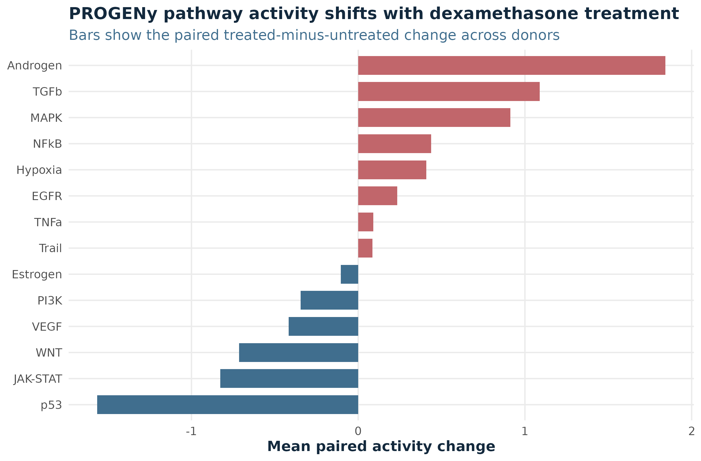
<figcaption aria-hidden="true">PROGENy activity</figcaption>
</figure>

| pathway  | mean_untrt | mean_trt | mean_delta | p_value |   padj |
|:---------|-----------:|---------:|-----------:|--------:|-------:|
| Androgen |    -0.9210 |   0.9210 |     1.8400 | 0.00154 | 0.0108 |
| p53      |     0.7830 |  -0.7830 |    -1.5700 | 0.00117 | 0.0108 |
| TGFb     |    -0.5440 |   0.5440 |     1.0900 | 0.21400 | 0.5440 |
| MAPK     |    -0.4560 |   0.4560 |     0.9120 | 0.16000 | 0.5440 |
| JAK-STAT |     0.4140 |  -0.4140 |    -0.8270 | 0.23300 | 0.5440 |
| WNT      |     0.3580 |  -0.3580 |    -0.7150 | 0.42400 | 0.7410 |
| NFkB     |    -0.2190 |   0.2190 |     0.4370 | 0.11500 | 0.5350 |
| VEGF     |     0.2090 |  -0.2090 |    -0.4180 | 0.30200 | 0.6030 |
| Hypoxia  |    -0.2040 |   0.2040 |     0.4090 | 0.66500 | 0.8140 |
| PI3K     |     0.1730 |  -0.1730 |    -0.3460 | 0.58000 | 0.8140 |
| EGFR     |    -0.1170 |   0.1170 |     0.2330 | 0.75600 | 0.8140 |
| Estrogen |     0.0524 |  -0.0524 |    -0.1050 | 0.90800 | 0.9080 |
| TNFa     |    -0.0454 |   0.0454 |     0.0909 | 0.68000 | 0.8140 |
| Trail    |    -0.0425 |   0.0425 |     0.0850 | 0.73300 | 0.8140 |

<figure>
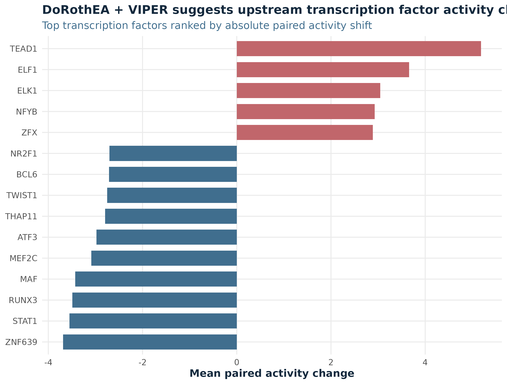
<figcaption aria-hidden="true">VIPER / DoRothEA activity</figcaption>
</figure>

| tf     | mean_untrt | mean_trt | mean_delta |  p_value |   padj |
|:-------|-----------:|---------:|-----------:|---------:|-------:|
| TEAD1  |      -2.86 |     2.32 |       5.18 | 0.020600 | 0.1860 |
| ZNF639 |       1.98 |    -1.71 |      -3.69 | 0.119000 | 0.3100 |
| ELF1   |      -1.95 |     1.71 |       3.66 | 0.015400 | 0.1790 |
| STAT1  |       1.69 |    -1.86 |      -3.55 | 0.015200 | 0.1790 |
| RUNX3  |       1.82 |    -1.66 |      -3.49 | 0.000233 | 0.0315 |
| MAF    |       1.66 |    -1.77 |      -3.43 | 0.002720 | 0.1050 |
| MEF2C  |       1.49 |    -1.60 |      -3.09 | 0.016500 | 0.1790 |
| ELK1   |      -1.67 |     1.37 |       3.05 | 0.007110 | 0.1480 |
| ATF3   |       1.67 |    -1.31 |      -2.98 | 0.009830 | 0.1570 |
| NFYB   |      -1.60 |     1.32 |       2.93 | 0.024500 | 0.1950 |
| ZFX    |      -1.65 |     1.24 |       2.89 | 0.069500 | 0.2300 |
| THAP11 |       1.62 |    -1.18 |      -2.80 | 0.038400 | 0.2110 |

For a glucocorticoid treatment dataset, this layer is helpful because it
connects the observed transcriptional response back to plausible pathway
and TF programs rather than stopping at descriptive enrichment alone.

## 8. Optional advanced extension

This repository stops at the **gene-level count** workflow on purpose.
That keeps the example small, reproducible, and focused on the main
interpretation layers.

If the unresolved question were instead:

- whether isoform usage changes without a strong gene-level change
- whether specific splicing events shift with treatment
- whether regional genomic patterns matter

then the next layer would be a different kind of analysis:

- **DEXSeq / DRIMSeq** for differential transcript usage or exon-level
  changes
- **rMATS** for alternative splicing
- **PREDA** for genomic region-level patterns

That is not just “more downstream analysis.” It is a different layer
that uses information lost when counts are collapsed to genes.

A note on deconvolution: this repo does **not** make tissue
deconvolution a core step because `airway` is a primary-cell dataset
rather than a mixed-tissue benchmark. It can be mentioned conceptually,
but it is not the biologically natural extension here.

## 9. Key takeaways

- The airway dataset is a clean paired example of dexamethasone response
  in human airway smooth muscle cells.
- DESeq2 establishes the gene-level answer: which genes change, by how
  much, and with what statistical support.
- ORA and GSEA move the story from individual genes to biological
  programs.
- ssGSEA shows how those programs vary at the sample level rather than
  only at the contrast level.
- PROGENy and DoRothEA + VIPER move one step further upstream and ask
  what signaling or TF activity might explain the observed pattern.
- Differential expression is the anchor, but it is not the full
  interpretation. The most useful biological answer usually comes from
  combining several layers carefully.
